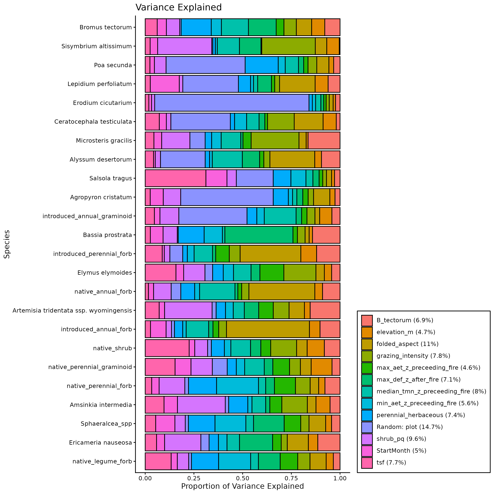
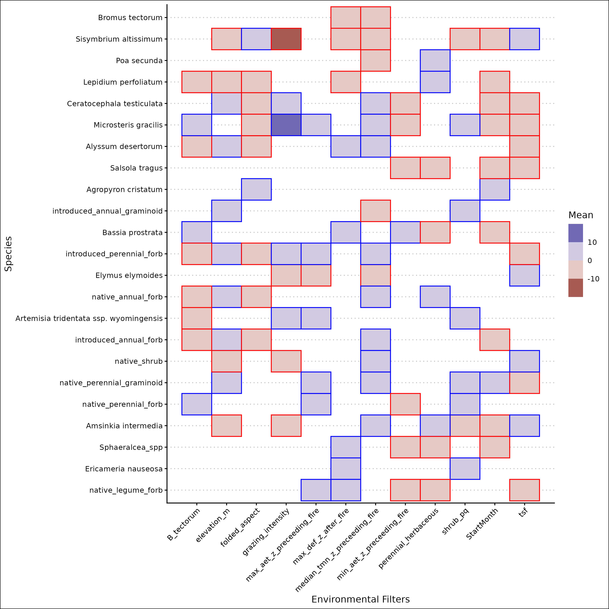
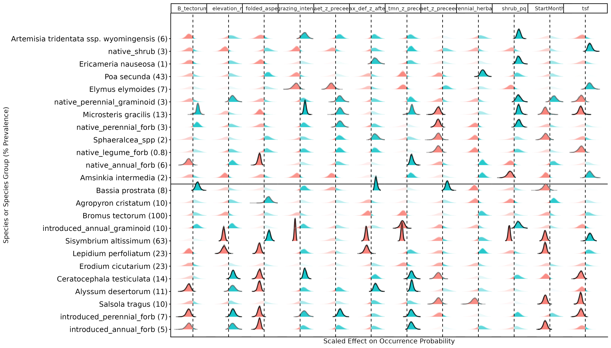
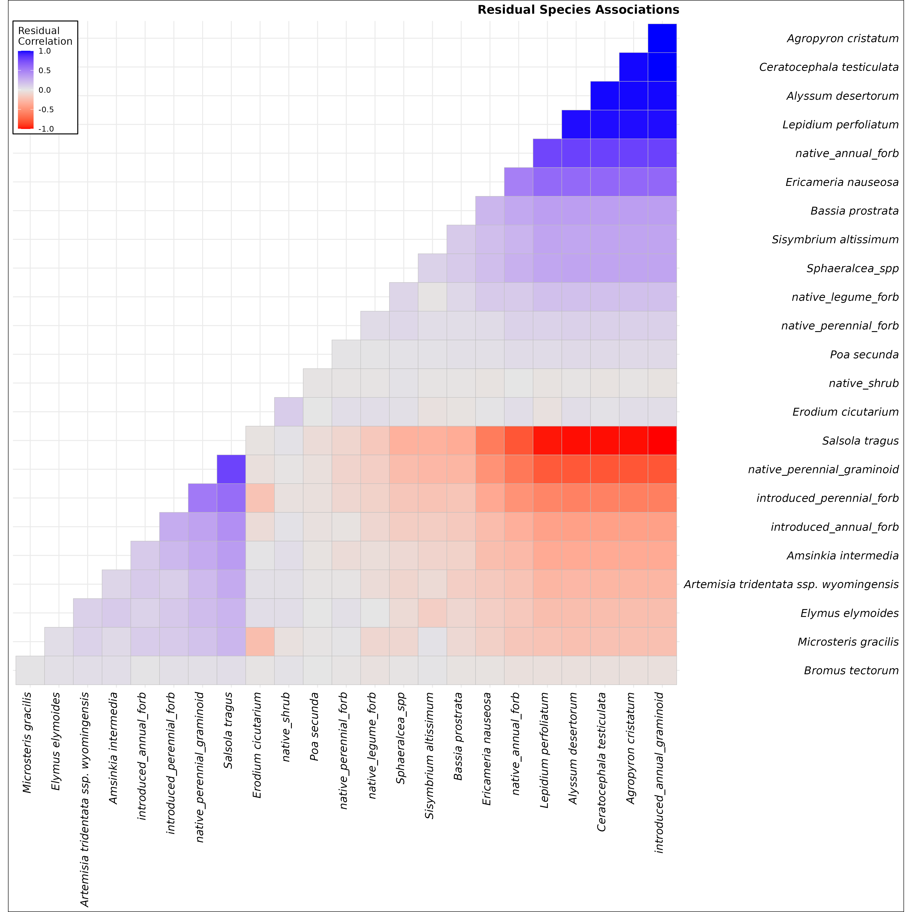

# gghmsc

ggplot functions for use with HMSC Joint Species Distribution Models

Please raise an issue if you have any questions, bugs or feature requests

Example data and plots are from an earlier version of a model in:

Mahood, A.L., Chambers, J.C., Barnard, D.M., Suding, K.N., and Balch, J.K. (2025) “Non-native grass invasion drives biodiversity loss after a single fire in a semi-arid shrubland,” Biological Conservation, 310, p. 111400. Available at: https://doi.org/10.1016/j.biocon.2025.111400.

## gghm_convergence

This function is to check model convergence. on the left you'll have ESS, which is effective sample size, and on the right you'll have your psrf (R hat). psrf you want below 1.1 (or 1.001), and ESS you want to ideally match the number of samples (so for 1000 samples, and 4 chains, you want 4000).

`data('Hm')`

`gghm_convergence(Hm)`

## gghm_vp

This function is to visualize variance partitioning. 

`data(Hm)`

`gghm_vp(Hm)`

## gghm_beta

This visualizes the effect that envionrmental covariates have on the species as colored boxes

`data(Hm)`

`gghm_beta(Hm)`

## gghm_beta2

This visualizes the effect that envionrmental covariates have on the species as probability density functions (PDF).

gghm_beta2 takes longer to run, becuase it displays the entire PDF from *each chain*, so not only can you see whether this or that variable has a positive or negative effect on the response of this or that species, you can also see whether or not the model is converged for that effect.

`data(Hm)`

`gghm_beta2(Hm)`

## gghm_omega

This shows the correlation matrix among species after accounting for environmental covariates, traits, phylogeny and random effects

`data(Hm)`

`gghm_omega(Hm)`

